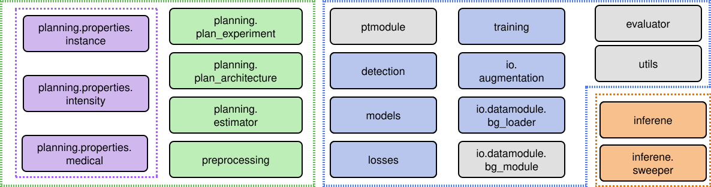

===============
Developer Guide
===============

TODO: interaction diagram of the different classes  (ptmodule = core)

Intro ... # TODO

Developer Flags
===============

nnDetection supports a broad range of configurations to provide extended information regarding models and training behavior.
These need to be specifically enable by the user for e.g. debugging purposes:

* `det_extended_logging`: Enable extended logging for some of the models (e.g. criterions for DETR).

Registries
==========

nnDetection uses multiple Registries to keep track of different modules which can be exchanged to customize different parts of the pipelines.
To register a new component, the registry needs to be imported inside the python file and the component needs to be wrapped by the decorator.
An example is shown below:

.. code:: python

   from nndet.ptmodule import MODULE_REGISTRY # import the registry

    # the compoenent will automatically register under the class name
   @MODULE_REGISTRY.register # register component
   class RetinaUNetV001(...):
      ...

The registry can than be accessed as any other dictionary to retrieve the class of the registered component:

.. code:: python

   from nndet.ptmodule import MODULE_REGISTRY # import the registry

   # get class from registry
   module_cls = MODULE_REGISTRY["RetinaUNetV001"]
   
   # initialize object
   module = module_cls(
      model_cfg=model_cfg,
      trainer_cfg=trainer_cfg,
      plan=plan,
   )

To see which modules are available from the command line (e.g. for overwriting keys in the config) the following command can be used:

.. code:: bash

   # nndet_print_reg [registry prefix]

   # e.g. list all modules
   nndet_print_reg module

   # e.g. list all augmentations
   nndet_print_reg augmentation

.. warning::
   To register a component the corresponding python files needs to be imported during runtime.
   While the nnDetection core repository does this for the provided base configurations automatically, external Plugins need to take of this manually.
   Please refer to the Plugins Guide for more information.

MODULE_REGISTRY
***************
The module registry contains the core modules of nnDetection which inherits from the `Pytorch Lightning <https://github.com/PyTorchLightning/pytorch-lightning>`_ Module.
It is the main module which is used for training and inference and contains all the necessary steps to build the final models.
It can be imported from `nndet.ptmodule` and examples can be found in `nndet.ptmodule.retinaunet`.

AUGMENTATION_REGISTRY
*********************
The augmentation registry can be imported from `nndet.io.augmentation` and contains different augmentation configurations. Examples can be found in `nndet.io.augmentation.bg_aug`.

DATALOADER_REGISTRY
*******************
The dataloader registry contains different dataloader classes to customize the IO of nnDetection.
It can be imported from `nndet.io.datamodule` and examples can be found in `nndet.io.datamodule.bg_loader`.

PLANNER_REGISTRY
****************
New plans can be registered via the planner registry which contains classes to define and perform different architecture and preprocessing schemes.
It can be imported from `nndet.planning.experiment` and examples can be found in `nndet.planning.experiment.v001`.

OPTIMIZER_REGISTRY
******************
Different optimizers can be registered in the optimizer registry and selected via the `trainer_cfg.opt_class`. Depending on the configured optimizer class different configuration options and keys are available / need to be configured in the `trainer_cfg`.

Overview
********

Config Files
============

- train new model with `exp.tag` key

=================
Specialised Items
=================

Preprocessing
=============

Inference
=========

Training
========

Dataloading
***********

Customized Dataloaders
----------------------

Customized Augmentation Pipelines
---------------------------------

Lightning Module
****************

Customized Models
-----------------

nnDetection uses `Pytorch Lightning` for training to provide a widely used, standardiced structure for its models.
Instead of using the lightning module directly, all modules in nnDetection are build on `LightningBaseModule` (`nndet.ptmodule.module`) which integrates additional procedures to setup transformations, the evaluation and the prediction pipeline.
A flow chart visualising the call procedure of nnDetection can be found below.

# TODO: flow chart

Each detection module in nnDetection should be a combination of the `LightningBaseModule` and multiple `Mixins` which are explained below.
By leveraging `Mixins` nnDetection can cover various input/output formats and provide models for: Bounding Box Detection + auxiliary task training, Instance Segmentation + auxiliary task training.
An example which builds a standard RetinaNet is shown below:

.. code:: python
    
    class RetinaNetModule(
        # nnDetection Base Module to integrate other mixins
        LightningBaseModule,
        # Convert the dataloader output to bounding boxes
        BoxesPrepareMixin,
        # Run Bounding Box evaluation during training
        BoxEvalMixin,
        # Use model structure of single stage detector
        SingleStageMixin,
        # Run the default Bounding Box Prediction and Sweep
        BoxPredictionMixin,
    ):
        # Cutomize SingleStageMixin attributes to switch between backbones,
        # necks, heads, sampling strategies, losse and much more
        ...

LightningBaseModule
~~~~~~~~~~~~~~~~~~~
The base module provides a standardized initialization procedure for all detection modules and is responsible for initializing the `Mixins`.
Every module should be composed of multiple `Mixins` which define the transformations to provide the ground truth format, model building structure, evaluation, optimizers and predictions pipeline.
More information about `Mixins` can be found below.
Furthermore, the base module configures some standardized callbacks like `EpochTimerCallback` and `Stochastic Weight Averaging (SWA)`.
`SWA` can be enabled by configuring the `swa_epochs` key in the config file.

Optimizers
~~~~~~~~~~
The optimizer class can be defind via the `trainer_cfg.opt_class` entry in the configs, please refer to the `OPTIMIZER_REGISTRY` for more info.

Model Mixins
~~~~~~~~~~~~
The `ModelMixin` (`nndet.ptmodule.mixins.model`) is responsible for building the model.
It provides the `from_config_plan` classmethod which will be called by the `LightningBaseModule` to initialize the model.
Depnding on the exact model type, different methods can be overwritten to customize the building behavior of the individual parts of the model.
Most changes can be made without overwriting methods though.
The `ModelMixin` introduces several class attributes which can be used to exchange modules, an example is provided below:

`SingleStageMixin`
 .. code:: python                         
                                          
    class SingleStageMixin(ModelMixin):   
        head_classifier_cls = ...         

`Binary Cross Entropy Loss`
 .. code:: python  
                          
    from nndet.nn.heads.classifier import BCECLassifier
                                 
    class SingleStageDetectorBCELoss(
        ...
        SingleStageMixin,
        ...
        ):      
        head_classifier_cls = BCECLassifier    

`Cross Entropy Loss`
 .. code:: python 
                           
    from nndet.nn.heads.classifier import CECLassifier
                                 
    class SingleStageDetectorCELoss(
        ...
        SingleStageMixin,
        ...
        ):      
        head_classifier_cls = CECLassifier         

Prepare Mixins
~~~~~~~~~~~~~~
`PrepareMixin`s are responsible for converting the output of the dataloader into the desired target format and can be xustomized by overwriting the `get_pre_transforms` method.
Sometimes it is necessary to add multiple `PrepareMixin` to create different ground truth formats, e.g. Retina U-Net requires bounding boxes and semantic segmentations.
In general there are three `PrepareMixin` Types which save the result in different keys:

- `BoxesPrepareMixin` saves the boxes in `boxes` and class in `classes`
- `SemanticPrepareMixin` save semantic segmentation into `target_seg`
- `SemanticFgPrepareMixin` save semantic segmentation (fg vs bg) into `target_seg`
- `BinaryMasksPrepareMixin` save binary masks into `target_binary_masks`

Eval Mixins
~~~~~~~~~~~
The `EvalMixin` defines the metrics which are tracked during the trainig.
It provides three important methods which can be used to customize the bahvior:

- `evaluation_init`: initilize the `Evaluator` (see `nndet.evaluator`) object
- `evaluation_step`: is called in every validation step and should cache intermediate results
- `evaluation_end`: is called at the end of the validation epoch to compute the final validation metrics.

Since most detection metrics are computed over the whole data set `evaluation_step` usually does not return intermediate metrics and `evaluation_end` will aggreagte the prediction and gt to compute the final set of metrics.

.. warning::
    While Distributed training can be used in nnDetection, the cached values inside the `Evaluator` are not synchronized between different workers.
    As a result, every worker will compute it's own set of metrics and these will be averaged over the workers.

Predict Mixins
~~~~~~~~~~~~~~
The prediction consists of two parts: `sweep` which is executed after the training to determine the best inference parameters and `get_predictor` which will create a predictor object to run inference.
These methods can be used to customize the sweeping and inference strategy of the module by exchanging the initialization of the `Sweeper` Object and `Predictor` / `Ensembler` objects.

Customized Losses
-----------------

There are four different loss categories in nnDetection:

- `regression`: theses losses are usually used for regression tasks (e.g. regression of bounding boxes) 
   and receive inputs in the form `[*, #dims * 2]` where `*` are arbitrary dimensions and `#dims` are
   the number of spatial dimenesions. Example shapes: RetinaNet `[N, #dims * 2]`, RCNN `[R, #dims * 2]`,
   DETR `[T, #dims * 2]` where `N` is the number of anchors, `R` is the number of RoIs, `T` number
   of matched boxes.
- `classification`: these losses are used for classification task and receive inputs in the form
   `[*, C]` where `*` are arbitrary dimensions and `C` is the number of *foreground* classes. The targets
   are encoded as numerical values. Note this is different to pytorch where the number
   of classes is usually located at the first dimension. Example shapes: RetinaNet `[N, C]`,
   RCNN `[R, C]`, DETR `[B, T, C]` where `N` is the number of anchors,
   `R` is the number of RoIs, `B` is the batch size, `T` number of boxes per image.
   In this setting, the targets are provided as numerical values where `0`
   is considered background and thus when creating the one hot encoding the 
   first channel (which is filled with 0s) is removed (so the maximal value in
   targets is `C+1` in this case). This is different from the segmentation losses
   where number of classes refers to the total number of clases (i.e. in this
   case the maximal value in targets should be equal to `C`)!
- `segmentation`: these losses are used for per-location classifiation of feature maps.
   They receive input in the form of `[B, C, *]`, where `B` is the batch size, 
   `C` is the number of classes and `*` are arbitrary dimensions.
- `mask`: these losses are used for per-location binary classification of feature maps.
   The input follows the same format at segmentation losses but the targets
   are already ont hot encoded, i.e. they have shape `[B, C, *]` , where `B` is
   the batch size, `C` is the number of classes and `*` are arbitrary dimensions.

Custom Splits
-------------
#TODO: add docs

Evaluation
==========
