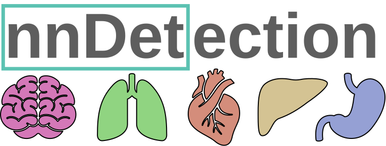
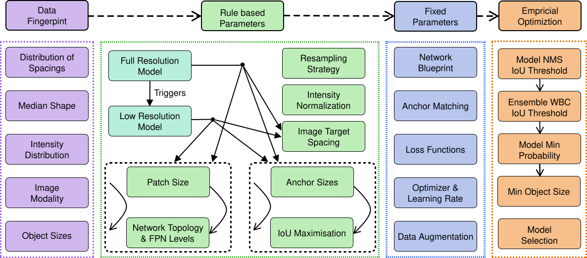

.. nnDetection documentation master file, created by
   sphinx-quickstart on Wed Oct 20 16:22:19 2021.
   You can adapt this file completely to your liking, but it should at least
   contain the root `toctree` directive.

|
|

**If you used nnDetection for your project please cite the following publication(s):**

.. code-block::

   Just testing here

TODOs
=====
- application limited to 3D
- Pointer to Projects and Plugins

What is nnDetection?
====================
Simultaneous localisation and categorization of objects in medical images, also referred to as medical object detection, is of high clinical relevance because diagnostic decisions depend on rating of objects rather than e.g. pixels.
For this task, the cumbersome and iterative process of method configuration constitutes a major research bottleneck. 
Recently, nnU-Net has tackled this challenge for the task of image segmentation with great success.
Following nnU-Net’s agenda, in this work we systematize and automate the configuration process for medical object detection.
The resulting self-configuring method, nnDetection, adapts itself without any manual intervention to arbitrary medical detection problems while achieving results en par with or superior to the state-of-the-art.

|

Contents:
=========

.. toctree::
   :maxdepth: 2
   :caption: Contents:

.. toctree::
   :maxdepth: 2

   installation

.. toctree::
   :maxdepth: 2

   user_guide

.. toctree::
   :maxdepth: 2

   dev_guide

.. toctree::
   :maxdepth: 2

   projects

.. toctree::
   :maxdepth: 2

   plugins

.. toctree::
   :maxdepth: 2

   api/index

Acknowledgements
================
nnDetection incorporates the information from multiple open source repositores which we wish to acknoledge for their awesome work, please check them out!

`nnU-Net <https://github.com/MIC-DKFZ/nnUNet>`_

nnU-Net is self-configuring method for semantic segmentation and many steps of nnDetection follow in the footsteps of nnU-Net.

`Medical Detection Toolkit <https://github.com/MIC-DKFZ/medicaldetectiontoolkit>`_

The Medical Detection Toolkit introduced the first codebase for 3D Object Detection and multiple tricks were transferred to nnDetection to assure optimal configuration for medical object detection.

`Torchvision <https://github.com/pytorch/vision>`_

nnDetection tried to follow the interfaces of torchvision to make it easy to understand for everyone coming from the 2D (and video) detection scene. As a result we used based our implementations of some of the core modules of the torchvision implementation.

Funding
=======
Part of this work was funded by the Deutsche Forschungsgemeinschaft (DFG, German Research Foundation) – 410981386 and the Helmholtz Imaging Platform (HIP), a platform of the Helmholtz Incubator on Information and Data Science.

Indices and tables
==================

* :ref:`genindex`
* :ref:`modindex`
* :ref:`search`
