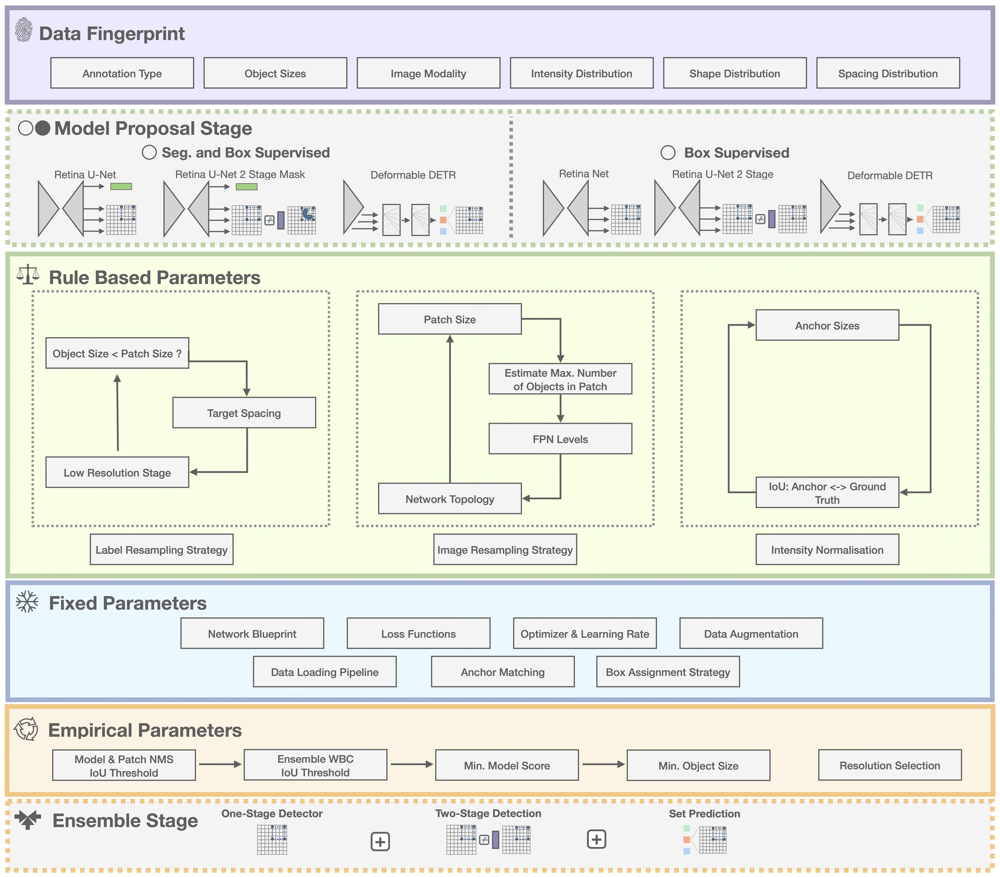
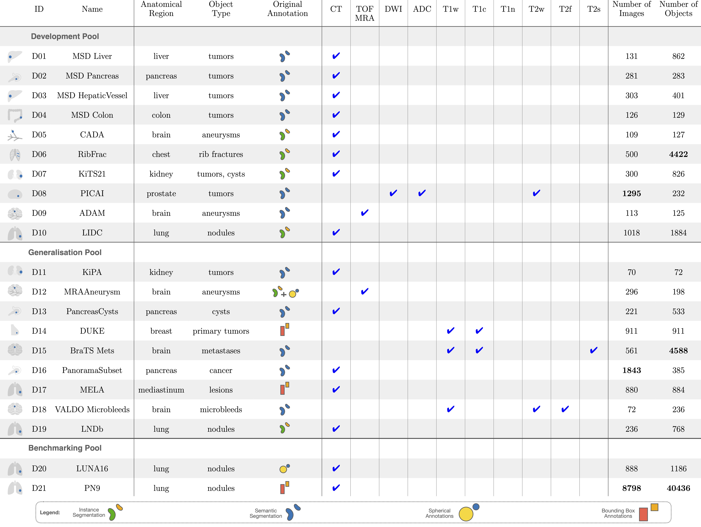
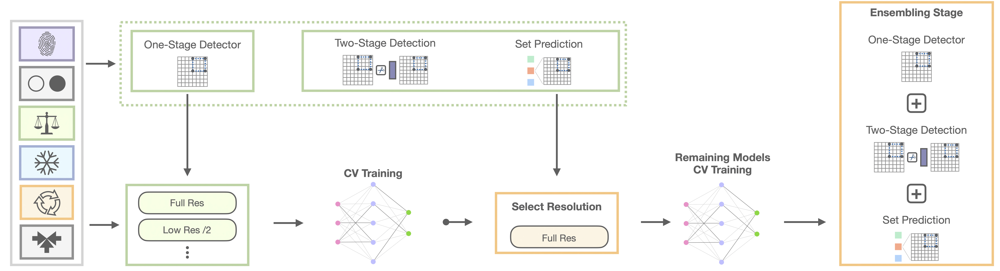

.. _user_guide-label:

User Guide
==========

This section includes dedicated guides to use nnDetection as a self-cofiguring baseline for volumetric (i.e. 3D like CT, MR etc.) detection tasks.
It provides an exmaple application via the toy dataset which generates an artifical training and testing dataset for a simple 3D detection task.
The guide also includes a detailed explanation of the data set format and how to prepare data sets for nnDetection.
Specifically, 21 data sets are provided with detailed guides on how to prepare them for nnDetection.

Internally nnDetection is based on a complex set of rules, fixed and empirical optimisation but it will execute everything automatically -> As a user it is only necessary to execute a few commands in a sequential order to obtain state-of-art detction resutls |:tada:|.

|
|

Preparing Data Sets
*******************

Toy Data Set
------------

Running `nndet_example` will automatically generate an example data set with 3D squares and sqaures with holes which can be used to test the installation or experiment with prototype code (it is still necessary to run the other nndet commands to process/train/predict the data set).

.. code-block:: bash

    # create data to test installation/environment (10 train 10 test)
    nndet_example

    # create full data set for prototyping (1000 train 1000 test)
    nndet_example --full [--num_processes]

The `full` problem is very easy and the final results should be near perfect (even after very short training).
After running the generation script follow the `Planning`, `Training` and `Inference` instructions below to construct the whole nnDetection pipeline.

.. note::

    The toy data set does not require the full training, it is recommended to use the `toy` config for training it.
    The training command for the toy data set is provided below:

    .. code-block::
        
        # this is a very short training schedule specifically to speed up the toy data set and should not be used in any other circumstance!
        nndet_train 000 toy 0 --sweep

Paper Experiments
-----------------

.. note::

    The data sets used for our experiments are not hosted or maintained by us, please give credit to the authors of the data sets.
    Some of the labels were corrected in data sets which we converted and can be downloaded (links can be found in the guides).

Besides the self-configuring method, nnDetection acts as a standard interface for many data sets.

|
|

We provide guides to prepare all data sets from our evaluation to the correct and make it easy to reproduce our resutls.
The guides are located in the source repository under `/tasks` and include:

Development Pool:

* D01 as Task 003 Liver: nndetection/tasks/Task001_Decathlon
* D02 as Task 007 Pancreas: nndetection/tasks/Task001_Decathlon
* D03 as Task 008 HepaticVessel: nndetection/tasks/Task001_Decathlon
* D04 as Task 010 Colon: nndetection/tasks/Task001_Decathlon
* D05 as Task 017 CADA: nndetection/tasks/Task017_CADA
* D06 as Task 020 RibFrac: nndetection/tasks/Task020_RibFrac
* D07 as Task 035 KiTS21: nndetection/tasks/Task_035_KiTS21
* D08 as Task 036 PICAI: nndetection/tasks/Task_036_PICAI
* D09 as Task 037 ADAM TOF A: nndetection/tasks/Task_037_ADAM_TOF_A
* D10 as Task 045 LIDC: nndetection/tasks/Task044_LIDC_pylidc

Generaliation Pool:

* D11 as Task 038 KiPA: nndetection/tasks/Task038_KiPA
* D12 as Task 052 MRAAneurysms: nndetection/tasks/Task052_MRAAneurysms
* D13 as Task 041 PancreasCysts: nndetection/tasks/Task041_PancreasCysts
* D14 as Task 042 Duke: nndetection/tasks/Task042_Duke
* D15 as Task 057 BraTSMets: nndetection/tasks/Task057_BraTSMets
* D16 as Task 056 PanoramaSubset: nndetection/tasks/Task056_PanoramaSubset
* D17 as Task 050 MELA: nndetection/tasks/Task050_MELA
* D18 as Task 051 VALDO Microbleeds: nndetection/tasks/Task051_VALDO_Microbleeds
* D19 as Task 054 LNDb: nndetection/tasks/Task054_LNDb

Benchmarking Pool:

* D20 as Task 016 Luna: nndetection/tasks/Task016_Luna
* D21 as Task 053 PN9: nndetection/tasks/Task053_PN9

Dataset scripts from nnDetection V1:

* Task 011 Kits: nndetection/tasks/Task011_Kits
* Task 012 LIDC: nndetection/tasks/Task012_LIDC
* Task 021 ProstateX: nndetection/tasks/Task021_ProstateX
* Task 025 LymphNodes (updared to Task 046): nndetection/tasks/Task025_LymphNodes

Adding New Data Sets
--------------------
nnDetection relies on a standardized input format which is very similar to `nnU-Net <https://github.com/MIC-DKFZ/nnUNet>`_ and allows easy integration of new data sets.
More details about the format can be found below.

Folders
~~~~~~~
All data sets should reside inside `Task[Number]_[Name]` folders inside the specified detection data folder (the path to this folder can be set via the `det_data` environment flag).
To avoid conflicts with our provided pretrained models we recommend to use task numbers starting from 100.
An overview is provided below ([Name] symbolise folders, `-` symbolise files, indents refer to substructures)
Note: Please avoid `.` inside file names since it can influence how paths/names are splitted.
File names can follow two format definitions `{patient id}_{session id}_{modality id}.{data extension}` (if `session_id` is enabled in `dataset.json`) or `{patient id}_{modality id}.{data extension}` (if `session_id` is disabled in `dataset.json`).
The first format groups multiple scans of the same patient to avoid leakage between training, validation and test sets.

.. code-block:: text

    ${det_data}
        [Task000_Example]
            - dataset.json # dataset.json works too
            [raw_splitted]
                [imagesTr]
                    - case0000_000_0000.nii.gz # patient case0000 session 000 modality 0
                    - case0000_000_0001.nii.gz # patient case0000 session 000 modality 1
                    - case0001_000_0000.nii.gz # patient case0001 session 000 modality 0
                    - case0000_000_0001.nii.gz # patient case0001 session 000 modality 1
                [labelsTr]
                    - case0000_000.nii.gz # segmentation patient case0000 session 000
                    - case0000_000.json # properties of patient case0000 session 000
                    - case0001_000.nii.gz # segmentation patient case0001 session 000
                    - case0001_000.json # properties of patient case0001 session 000
                [imagesTs] # optional, same structure as imagesTr
                ...
                [labelsTs] # optional, same structure as labelsTr
                ...
        [Task001_Example1]
            ...

Data Set Info
~~~~~~~~~~~~~
`dataset.yaml` or `dataset.json` provides general information about the data set:
Note: [Important] Classes and modalities start with index 0!

.. code-block:: yaml

    # [mandatory information]
    task: Task000D3_Example
    dim: 3 # number of spatial dimensions of the data

    labels: # classes of data set; need to start at 0
        "0": "Square"
        "1": "SquareHole"

    modalities: # modalities of data set; need to start at 0
        "0": "CT"

    # [optional information]
    # Note: need to use integer value which is defined below of target class!
    session_id: False # if multiple sessions of the same patient are available, default `False`
    target_class: 1 # define class of interest for patient level evaluations, default `None`
    test_labels: True # manually splitted test set for further evaluation, default `False`

Image Format
~~~~~~~~~~~~

nnDetection uses the same image format as nnU-Net.
Each case consists of at least one 3D nifty file with a single modality and are saved in the `images` folders.
If multiple modalities are available, each modality uses a separate file and the sequence number at the end of the name indicates the modality (these need to correspond to the numbers specified in the data set file and be consistent across the whole data set).

An example with two modalities could look like this:

.. code-block:: text

    - case001_000_0000.nii.gz # Case ID    patient: case001; session: 000; Modality: 0
    - case001_000_0001.nii.gz # Case ID    patient: case001; session: 000; Modality: 1

    - case002_000_0000.nii.gz # Case ID    patient: case002; session: 000; Modality: 0
    - case002_000_0001.nii.gz # Case ID    patient: case002; session: 000; Modality: 1

If multiple modalities are available, please check beforehand if they need to be registered and perform registration befor nnDetection preprocessing. nnDetection does (!)not(!) include automatic registration of multiple modalities.
All images need to have the same number of modalities.

Label Format
~~~~~~~~~~~~

Labels are encoded with two files per case: one nifty file which contains the instance segmentation and one json file which includes the "meta" information of each instance.
The nifty file should contain all annotated instances where each instance has a unique number and are in consecutive order (e.g. 0 ALWAYS refers to background, 1 refers to the first instance, 2 refers to the second instance ...)
`case[XXXX].json` label files need to provide the class of every instance in the segmentation. In this example the first isntance is assigned to class `0` and the second instance is assigned to class `1`:

.. code-block:: json

    {
        "instances": {
            "1": 0,
            "2": 1
        }
    }

Each label file needs a corresponding json file to define the classes. The corresponding image and labels files need to have the same size (in terms of voxels).
In case of weak annotations, they need to be converted into segmentation maps before using them within nnDetection. We usually recommend representing them as boxes or spheres in the segmentation map.
Depending on the chosen network, the segmentation won't be used during training but we have observed better results when augmenting dense masks rather than extreme points.
Since in the 3D space, a single point can only be occupied by a single object this procedure can be executed without loss of generality.
In some cases, boxes might slightly overlap with each other, than we recommend starting with the largest boxes and sequentially pasting smaller objects to retain the size of the smallest obejcts.

Using nnDetection
*****************

The following paragrah provides an high level overview of the functionality of nnDetection and which commands are available.
A typical flow of commands would look like this:

.. note::

    nndet_prep -> nndet_unpack -> nndet_cv_split -> nndet_train -> nndet_consolidate -> nndet_predict

Eachs of this commands is explained below and more detailt information can be obtained by running `nndet_[command] -h` in the terminal.

Planning & Preprocessing
------------------------

Before training the networks, nnDetection needs to preprocess and analyze the data.
The preprocessing stage normalizes and resamples the data while the analyzed properties are used to create a plan which will be used for configuring the training.
nnDetectionV0 requires a GPU with approximately the same amount of VRAM you are planning to use for training (we used a RTX2080TI; no monitor attached to it) to perform live estimation of the VRAM used by the network.
(Future releases aim at improving this process...)

.. code-block:: bash

    nndet_prep [tasks] [-o / --overwrites] [-np / --num_processes] [-npp / --num_processes_preprocessing] [--full_check]

    # Example
    nndet_prep 000

    # Script
    # /scripts/preprocess.py - main()

`-o` option can be used to overwrite parameters for planning and preprocessing (refer to the config files to see all parameters). The number of processes used for cropping and analysis can be adjusted by using `-np` and the number of processes used for resampling can be set via `-npp`. The current values are fairly save if 64GB of RAM is available.
The `--full_check` will iterate over the data before starting any preprocessing and check correct formatting of the data and labels.
If any problems occur during preprocessing please run the full check to make sure that the format is correct.

After planning and preprocessing the resulting data folder structure should look like this:

.. code-block:: text

    [Task000_Example]
        [raw_splitted]
        [raw_cropped] # only needed for different resampling strategies
            [imagesTr] # stores cropped image data; contains npz files
            [labelsTr] # stores labels
        [preprocessed]
            [analysis] # some plots to visualize properties of the underlying data set
            [properties] # sufficient for new plans
            [labelsTr] # labels in original format (original spacing)
            [labelsTs] # optional
            [Data identifier; e.g. D3V001_3d]
                [imagesTr] # preprocessed data
                [labelsTr] # preprocessed labels (resampled spacing)
            - {name of plan}.pkl # e.g. D3V001_3d.pkl

Befor starting a training copy the data (Task Folder, data set info and preprocessed folder are needed) to a SSD (highly recommended) and unpack the image data with

.. code-block:: bash

    nndet_unpack [path] [num_processes]

    # Example (unpack example with 6 processes)
    nndet_unpack ${det_data}/Task000D3_Example/preprocessed/D3V001_3d/imagesTr 6

    # Script
    # /scripts/utils.py - unpack()

It is now also possible to use `nndet_unpack_task [task] [plans]` for unpacking.
Finally, it is necessary to create a data set split for the underlying data by running the following command:

.. code-block:: bash

    nndet_cv_split [task] [--num_folds] [--with_patients]

    # Example
    nndet_cv_split Task000D3_Example

    # Script
    # /scripts/utils.py - create_cv_split()

For more advanced options in the split functionality (like the '--with_patients' option) plese refer to the documentation of the function or create your own splitting function e.g. for hierarchical data.

Training and Evaluation
-----------------------

After the planning and preprocessing stage is finished the training phase can be started.
nnDetectio2E supports several object detection models which can be trained on multiple resolutions (if triggered during planning).
We recommend following this flow chart to first determine a good resolution and than training the remaining models:

The default setup is trained in a 5 fold cross-validation scheme.
First, check which plans were generated during planning by checking the preprocessing folder and look for the pickled plan files.
In most cases only the defaul plan will be generated (`D3V001_3d`) but there might be instances (e.g. Kits) where the low resolution plan will be generated too (`D3V001_3dlr1`).

.. code-block:: bash

    nndet_train [task] [config_name] [fold] [-o / --overwrites] [--sweep] [--continue_training] [--log_net] [--log_aug]

    # Example (train default plan D3V001_3d and search best inference parameters)
    nndet_train 000 toy 0 --sweep

    # Script
    # /scripts/train.py - train()

These commands run different models included in nnDetection2E:

.. code-block:: bash
    # One-stage detectors 
    nndet_train 000 retinaunet_focal_v002 0 --sweep # Retina U-Net V2
    nndet_train 000 retinaunet_focal_v002 0 -o module=RetinaNetFocalV002 --sweep # Retina Net V2

    # Two-stage detectors
    nndet_train 000 retinaunet2sm_v002 0 --sweep # Retina U-Net 2SM V2
    nndet_train 000 retinaunet2sm_v002 0 -o module=RetinaNet2SV002 --sweep # Retina Net 2S V2
    
    # Set prediction models
    nndet_train 000 def_detr_v002 0 --sweep # Deformable DETR V2

If your dataset is annoated with weak annotations (bounding boxes, spheres, etc.) you should train `Retina Net V2, Retina Net 2S V2, Deformable DETR V2` and if the dataset includes dense pixel-wise annotations these models should be trained: `Retina U-Net V2, Retina U-Net 2SM V2, Deformable DETR V2`.

`nndet_train` needs to be run for every fold separately, by default this means running it 5 times with `fold` varying between 0 and 4 (inclusive).
`--continue_training` can be activated to continue training from the last saved checkpoint.
The training time can vary between ~1 day (A100) to ~2 days (RTX2080TI) *per fold* (with correct mixed precision acceleration of 3D convolutions and no other bottlenecks, see FAQ section for common bottlenecks and how to diagnose them).
The `--sweep` option tells nnDetection to look for the best hyparameters for inference by empirically evaluating them on the validation set.
Sweeping can also be performed later by running the following command:

.. code-block:: bash

    nndet_sweep [task] [model] [fold]

    # Example (sweep Task 000 of model RetinaUNetV001_D3V001_3d in fold 0)
    nndet_sweep 000 RetinaUNetV001_D3V001_3d 0

    # Script
    # /experiments/train.py - sweep()

Evaluation can be invoked by the following command (requires access to the model and preprocessed data):

.. code-block:: bash

    nndet_eval [task] [model] [fold] [--test] [--case] [--boxes] [--analyze_boxes]

    # Example (evaluate and analyze box predictions of default model)
    nndet_eval 000 RetinaUNetV001_D3V001_3d 0 --boxes --analyze_boxes

    # Script
    # /scripts/train.py - evaluate()

    # Note: --test invokes evaluation of the test set

It is now also possible to invoke the evaluation on individual folders with `nndet_eval_with_folders`.

Consoldiate and Model Ensembling
--------------------------------

After running all folds it is time to collect the models and creat a unified inference plan.
The following command will copy all the models and predictions from the folds. By adding the `sweep_` options, the empiricaly hyperparameter optimization across all folds can be started.
This will generate a unified plan for all models which will be used during inference.

.. code-block:: bash

    nndet_consolidate [task] [model] [--overwrites] [--consolidate] [--num_folds] [--no_model] [--sweep]

    # Example
    nndet_consolidate 000 RetinaUNetV001_D3V001_3d --sweep

    # Script
    # /scripts/consolidate.py - main()

To determine the best ensemble of models for nnDetection2E the following command can be used:

.. code-block:: bash

    nndet_determine_best_ensemble_with_task [task] [new model name] [+models to ensemble]]

    # Example
    # for weak annotations
    nndet_determine_best_ensemble_with_task 000 nnDetectionV2_ensemble RetinaNetFocalV002_D3V002_3d RetinaNet2SV002_D3V002_3d BoxDeformableDETRV002_D3V002_3d

    # for segmentation annotations
    nndet_determine_best_ensemble_with_task 000 nnDetectionV2_ensemble RetinaUNetFocalV002_D3V002_3d RetinaUNet2SMV002_D3V002_3d BoxDeformableDETRV002_D3V002_3d

    # Script
    # /scripts/ensemble.py - entrypoint_determine_best_ensemble_with_task()

This will create a new model folder and create config files to perform the ensembling.

The actual ensembling step can than be executed via the following command:

.. code-block:: bash
    nndet_ensemble_with_determined_model [task] [model] [fold] [--test]

    # Example
    nndet_ensemble_with_determined_model 000 nnDetectionV2_ensemble -1

This will execute the ensembling step with the determined model and parameter configuration.
More fine grained control for custom use cases is provided via `nndet_ensemble_with_task`, `nndet_ensemble_with_models` and `nndet_ensemble_with_folders` where parameters and models can be manually defined.
Refer to the code documentation in `nndet_scripts/ensemble.py` for more information.

Inference
---------

For the final test set predictions simply select the best model according to the validation scores and run the prediction command below.
Data which is located in `raw_splitted/imagesTs` will be automatically preprocessed and predicted by running the following command:

.. code-block:: bash

    nndet_predict_with_imagesTs [task] [model] [fold] [-ntta] [--skip_preprocessing] [-npp / --num_processes_preprocessing] [--load_models] [-o]

    # Example
    nndet_predict_with_imagesTs 000 RetinaUNetV001_D3V001_3d -1

    # Script
    # /scripts/predict2.py - main()

If a self-made test set was used, evaluation can be performed by invoking `nndet_eval` with `--test` as described above.
Other predict commands which allow more fine grained control for custom scenarios over input and output, please refer to the source file `/scripts/predict2.py` for more info.
Possible commands are `nndet_predict_with_task`, `nndet_predict_with_folders` and `nndet_predict_test_split`.

Results
-------

The final model directory will contain multiple subfolders with different information:

* `sweep`: contain information from the parameter sweeps and are only used for debugging purposes
* `sweep_predictions`: these contain prediction with additional ensembler state information which are used during the empirical parameter optimization. Since these save the model output in a fairly raw format they are bigger than the predictions seen during normal inference to avoid multiple model prediction runs during the parameter sweeps
* `[val/test]_predictions`: Contains the prediction of the validation/test set in the restored image space.
* `val_predictions_preprocessed`: This contains prediction in the preprocessed image space, i.e. the predictions from the resampled and cropped data. they are saved for debugging purposes.
* `[val/test]_results`: this folder contains the validation/test rsults computed by nnDetection. More information on the metrics can be found below.
* `val_results_preprocessed`: contains validation results inside the preprocessed image space are saved for debugging purposes

Evaluation
----------

The following section contains some additional information regarding the metrics which are computed by nnDetection. They can be found in `[val/test]_results/results_boxes.json`:

Most metric have an IoU attached to their evaluation, the value is usually part of the naming, e.g. `IoU_0.10` indicates an IoU threshold of `0.10`.
Some metrics are computed per class and thus per class values are also included for completeness e.g. `YY_AP_IoU_0.10` represents class `YY`.
Finally, some metrics are extended with additional analysis functions e.g. computed for a certain volume range which are indicated by additional letters (by default zVF where z various between categories, exact values can be found in the `results_curves` file)

* `AP_IoU_0.XX`: is the main metric used for the evaluation in our paper. Per default, the number of detections per image per class are limited to `400` but can be adjusted via `nndet_eval_max_detections_image_based`. 
* `mAP_IoU_0.XX_0.XX_0.XX`: Is the typically found COCO mAP metric evaluated at multiple IoU values. *The IoU thresholds are different from those of the COCO evaluation to account for the generally lower IoU in 3D data*.
* `FROCwp_IoU_0.10`: FROC computed at default FPPI values of (1/8, 1/4, 1/2, 1, 2, 4, 8), sensitivty at FPPI value is determined by last working point (not interpolated). This implementation pools all of the predictions and is *not* computed per class.
* `mc_FROCwp_IoU_0.10`: compute FROC per class and average across classes. This one should be used in most cases in multi class scenarios to stratify for the number of objects inside the classes.

nnDetection offers multiple ways to visualize results:

* `nndet_boxes2mitkv2`: this function creates predictions in the `[val/test]_predictions` folder. The latest version of MITK is needed to view these files. Just drag and drop the json files into MITK and the boxes are shown with their class and score. This method is highly recommended since it provides the best user experience.
* `nndet_boxes2nii`: this function creates predictions in the `[val/test]_predictions` folder in the original image space. The predictions are saved as nifty files with the same name as the original image files. They can be viewed in any medical image viewer. In addition to the segmentation the json files contain the scores. Overlapping predictions are not shown and or partially occluded.

nnU-Net for Detection
---------------------

The desired dataset need to be provided in nnDetection format, the labels need to be prepared via the `nndet_prep_labels` commands and nnU-Net needs to be installed and configured.
The provided dataset can be exported into nnU-Net format via `python nndet_scripts/nnunet/nnunet_export.py [task]`.
Than nnU-Net needs to be trained and the softmax predictions (this required an additional flag, npz files) need to be saved for further processing.
After training all models, `python nndet_scripts/nnunet/nnunet_import.py --nnuet [nnunet plan] --mode val --nnunet_model_name nnUNet3d --num_workers 6 [--simple]` can be executed to determine the postprocesing for nnU_Net on the validation set. By setting the mode to test, the test predictions can be determined (nnU-Net predict needs to be called first with the option to save the softmax logits i.e. the npz files).
An example can look like this `python nndet_scripts/nnunet/nnunet_import.py --nnuet $nnunet_base/nnunet_models/nnUNet/3d_fullres/${TASK}/nnUNetTrainerV2__nnUNetPlansv2.1 --mode val --nnunet_model_name nnUNet3d --num_workers 6 [--simple]`.
**We have only tested up to nnU-Net 1.7.1, nnU-Net v2 was not tested and is thus not supported.**
The normal nndet eval and ensembling functions can be called on the result afterwards.

Advanced Use Cases
******************

An advanced use case might require some minor coding which is not covered by the default functionality of nnDetection.
Nevertheless, some cases can occur frequently and are thus covered here. 

Evaluation Framework
--------------------

If the labels and predictions are present in the nnDetection format, evaluation of box predictions is as simple as:

.. code-block:: python

    from nndet.eval.registry import evaluate_box_dir

    classes = [YOUR CLASSES HERE]
    pred_dir = [YOUR PATH HERE]
    gt_dir = [YOUR PATH HERE]

    results = evaluate_box_dir(
        classes=classes,
        pred_dir=pred_dir,
        gt_dir=gt_dir,
    )

.. note::
    `nndet_eval_with_folders` provides a direct entrypoint to the above functionality.

The nnDetection format expects the ground truth labels to be saved in `npz` files with keys `boxes` and `classes`.
Predictions should be located in pkl files with keys `pred_boxes`, `pred_labels` and `pred_scores`.
All boxes need to be in the same coordinate system and follow the `ax0_min, ax1_min, ax0_max, ax1_max, ax2_min, ax2_max` format (ax denotes arbitrary axes).

Custom evaluation scripts can be esily created by passing the predictions and ground truth boxes to the evaluator.

.. code-block:: python

    from nndet.eval.det import BoxEvaluator

    classes = [YOUR CLASSES HERE]
    similarity_fn = [YOUR SIMILARITY FUNCTION e.g. box_iou_np]
    case_ids = [YOUR CASES]

    evaluator = BoxEvaluator.create(
        classes=classes,
        fast=False,
        verbose=True,
        similarity_fn=similarity_fn,
    )

    for case_id in case_ids:
        gt = [LOAD GROUND TRUTH]
        pred = [LOAD PREDICTION]

        evaluator.run_online_evaluation(
            pred_boxes=[pred["pred_boxes"]],
            pred_classes=[pred["pred_labels"]],
            pred_scores=[pred["pred_scores"]],
            gt_boxes=[gt["boxes"]],
            gt_classes=[gt["classes"]],
            gt_ignore=None,
            case_ids=[case_id],
        )
    return evaluator.finish_online_evaluation()

Custom Split
------------

Custom splits can be easily created by placing a `[your_split].json` file inside the preprocessing folder of the task.
The file should contain a list for the folds and each list item is a dict with keys 'train' and 'val' which contain the case ids for the respective split.
The training command should than be extended with the `+io_cfg.splits=[your_split]` option.

Running Unittests
-----------------

nnDetection provides a set of unittests which can be run by invoking the running the following command within the root dir:

.. code-block:: bash
    pytest .

The installation needs to be performed in `dev` mode to install all dependencies properly.

FAQ
***

Support for 2D Data Sets
------------------------
2D data sets are not supported since they are already amaying external repositories for these detection tasks, e.g. https://github.com/MIC-DKFZ/generalized_yolov5.

Multi GPU Training
------------------
Multi GPU training is not officially supported yet.
Inference and the metric computation are not properly designed to support these usecases!
